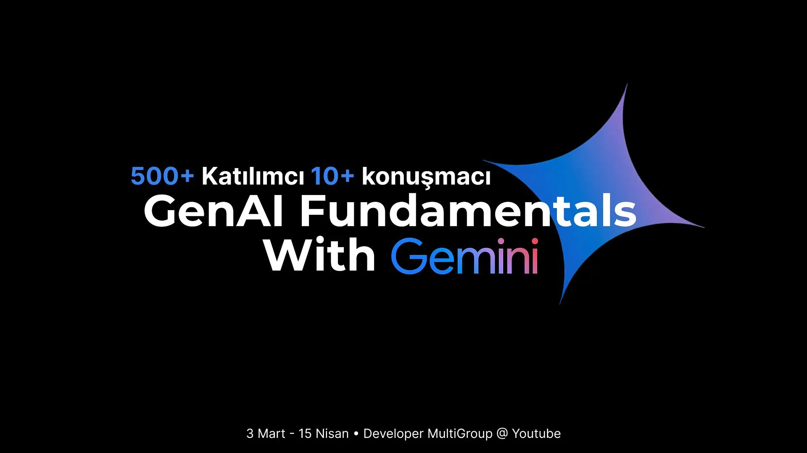

# MultiGroup Event Page
[](https://github.com/chetanraj/awesome-github-badges) [](https://opensource.org/licenses/MIT) [](https://GitHub.com/Developer-MultiGroup/multigroup-event-page/pulls/) [](https://GitHub.com/Developer-MultiGroup/multigroup-event-page/issues/)

## Overview

This repository is designed to help you easily access Developer MultiGroup's events. You can review previous or upcoming events here, and if you'd like to contribute, you can check out the `issues` section to support us. 

[Türkçe Dökümantasyon](/README.md)

## Features

- **Dynamic Structure:** Create and publish new events without the need for any database and storage service.
- **Add to Calendar:** Easily add event sessions to your calendar and stay in the flow.
- **Access Locations:** Easily access the event area with the map application suitable for your platform.
- **Responsive Design:** A fully dynamic design so you can follow our events from every platform.

## Technologies Used

- **Next.js:** User interface development.
- **Shadcn/ui:** Ready-to-use components.
- **Tailwind CSS:** Styling and responsive designs.
- **Pigeon Maps:** Dynamic display of event locations.
- **Vercel:** Code deployment.
- **Framer:** Component and page animations.

## Installation Instructions

### Prerequisites

- Node.js (version 16.x or later)
- npm or yarn

### Running Locally

```bash
$ git clone https://github.com/Developer-MultiGroup/multigroup-event-page.git
$ cd multigroup-event-page
$ npm install
$ npm run dev
```

Visit `http://localhost:3000` in your browser to see the development version.

## Event File Management

### Event Type Structure

```mermaid
classDiagram
    direction LR
    
    class Event {
        +number id
        +string name
        +string subTitle
        +string title
        +string description
        +Location location
        +string registerLink
        +string videoUrl
        +string date
        +string[] sponsors
        +Speaker[] speakers
        +Session[] sessions
        +AfterMetrics? afterMetrics
    }
    
    class Location {
        +number latitude
        +number longitude
        +string name
        +string subtext
    }
    
    class Speaker {
        +string fullName
        +string photoUrl
        +string title
    }
    
    class Session {
        +string topic
        +string startTime
        +string endTime
        +string speakerName
    }
    
    class AfterMetrics {
        +string applications
        +string vipGuests
        +string supporter
        +string speakers
        +string workingParticipant
        +string jobSeeker
        +string jobProvider
        +string satisfaction
    }

    Event *-- Location : has
    Event *-- Speaker : contains
    Event *-- Session : contains
    Event *-- AfterMetrics : tracks
```

### Photo Folders

```bash
/public/images
    ├── events
    │   └── event-name
    ├── speakers
    └── sponsors
```

The project's photo storage structure is as shown above.

#### Event Photos

Each event has 3 photos with specified names under its own name (slugified name).

#### Speaker Photos

All speaker photos are kept in this folder with slugified names, and when adding a speaker to any event, the photos are automatically taken from this folder when added with that name.

#### Sponsor Photos

The logic for sponsor photos is the same as speakers. Sponsor logos are kept in this folder with a slugified name, and this name is added to the array structure in the event object when needed.

## Creating a New Event

To create a new event, it's sufficient to create a new object in the `data/events.ts` file and write the fields specified above. The only thing to pay attention to is the names of the photos and where they are placed.

## Contributing

After setting up the project in your local environment by following the [Installation Instructions](#installation-instructions), you can make any changes you want and fix any bugs by sending a `Pull Request`. Follow these steps to send a PR:

1. **Create a `Fork` of the project**

2. **Create a new `Branch`**

    ```bash
    git checkout -b feature/your-feature
    # or
    git git checkout -b fix/your-fix
    ```

3. **Make your changes**

4. **Commit your changes**

    ```bash
    git add .
    git commit -m "feat: Add a descriptive commit message"
    # or 
    git commit -m "fix: Add a descriptive commit message"
    ```

5. **Push your changes to the `Repository`**

    ```bash
    git push origin feature/your-feature
    ```

6. **Open a `Pull Request`**
    Create a PR from your own `Fork` of this project in your profile to the main `Repository`

## Repo Activity

<!--  -->

[](https://star-history.com/#fDeveloper-MultiGroup/multigroup-event-page)

## License
Check out the [license](LICENSE) of this project.

## Contact
If you have any questions, feel free to reach out to me at `me@furkanunsalan.dev`.